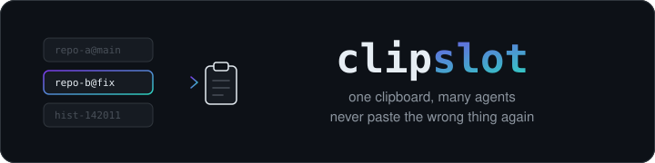

<div align="center">



<br>
<br>

[](LICENSE)
[](#install)
[](clipslot)
[](clipslot)
[](#contributing)

**Per-session clipboard slots + clipboard history for parallel AI coding sessions.**

</div>

---

You run several coding agents at once — Claude Code, Cursor, anything.
You ask session A to *"copy the result to the clipboard"*. Before you paste,
session B writes to the clipboard too. The system clipboard is one global
slot, last writer wins — and you paste the wrong thing into the wrong thread.

```text
without clipslot                        with clipslot

session A ──┐                           session A ──▶ slot repo-a@main
session B ──┼──▶ [ clipboard ] ◀── 💥   session B ──▶ slot repo-b@fix
session C ──┘    last writer wins       session C ──▶ slot repo-c@main
                                                          │
you: Cmd+V 🎲                           you: clipslot load ──▶ [ clipboard ] ──▶ Cmd+V ✅
```

## How it works

**① Agents write to slots, not the clipboard.** With the bundled Claude Code
skill / Cursor rule installed, agents run `clipslot copy` instead of `pbcopy`.
Content lands in a named slot (auto-named `repo@branch`) under `~/.clipslot/`.
Nothing touches the system clipboard, so sessions can't clobber each other.

**② You arm the clipboard last.** Right before pasting, run `clipslot load`,
pick the slot (fzf picker if installed, numbered menu otherwise) — only then
does it enter the real clipboard.

**③ A watcher covers everything else.** `clipslot watch start` snapshots
*every* clipboard change — any agent, any app, your own Cmd+C — into `hist-*`
slots (deduped, last 30 kept). Zero cooperation needed; clobbered content is
always recoverable.

## Install

```bash
git clone https://github.com/XACBD/clipslot.git
cd clipslot && ./install.sh
```

This installs the `clipslot` CLI to `~/.local/bin` and the Claude Code skill
to `~/.claude/skills/clipslot/`. One bash script, zero dependencies.
macOS (`pbcopy`/`pbpaste`) and Linux (`wl-copy`/`xclip`/`xsel`) supported.

## Usage

```bash
# agents save (the skill/rule makes them do this automatically)
git diff | clipslot copy              # slot auto-named, e.g. myrepo@main
some-cmd | clipslot copy fix-login    # explicit slot name

# you load, right before pasting
clipslot load                         # interactive picker
clipslot load myrepo@main             # directly by name

# clipboard history — the agent-independent safety net
clipslot watch start                  # snapshot every clipboard change
```

| Command                  | What it does                                      |
|--------------------------|---------------------------------------------------|
| `... \| clipslot copy [name]` | Save stdin to a slot (never touches the clipboard) |
| `clipslot copy -s [name]`| …and *also* copy to the system clipboard          |
| `clipslot load [name]`   | Put a slot into the system clipboard              |
| `clipslot list`          | All slots, newest first, with size / age / preview|
| `clipslot show [name]`   | Print a slot to stdout                            |
| `clipslot rm` / `clear`  | Remove one / all slots                            |
| `clipslot watch start\|stop\|status` | Manage the clipboard-history watcher  |

## Agent integrations

| Agent            | Setup                                                                 |
|------------------|-----------------------------------------------------------------------|
| **Claude Code**  | Installed automatically by `install.sh` ([`skill/SKILL.md`](skill/SKILL.md)) |
| **Cursor**       | Drop [`rules/clipslot.mdc`](rules/clipslot.mdc) into `.cursor/rules/`, or paste into *Settings → Rules* for all projects |
| **Anything that reads `AGENTS.md`** | Paste the section from [`rules/AGENTS-snippet.md`](rules/AGENTS-snippet.md) |
| **Agents you can't configure** | Just run `clipslot watch start` — every clipboard write gets snapshotted anyway |

## Configuration

| Variable                  | Default        | Meaning                                  |
|---------------------------|----------------|------------------------------------------|
| `CLIPSLOT_DIR`            | `~/.clipslot`  | Slot storage directory                   |
| `CLIPSLOT_HISTORY_MAX`    | `30`           | Max `hist-*` snapshots kept              |
| `CLIPSLOT_WATCH_INTERVAL` | `1`            | Watcher poll interval (seconds)          |
| `CLIPSLOT_COPY_CMD`       | auto           | Override clipboard **write** command (reads stdin) — e.g. an OSC52 helper over SSH |
| `CLIPSLOT_PASTE_CMD`      | auto           | Override clipboard **read** command      |

## FAQ

**How is this different from Maccy / Raycast clipboard history?**
Those solve recovery (like `clipslot watch`). clipslot's core is the other
half: a *protocol for agents* — slots named per repo/branch, plus skill/rule
files that teach Claude Code and Cursor to stop fighting over the clipboard
in the first place, and to tell you which slot they saved to.

**Two sessions on the same repo and branch?**
They'd share an auto-named slot — pass explicit names (`clipslot copy
task-a`). The skill/rule files instruct agents to do this.

**What about images?**
Text only, by design. Rich content is out of scope for one bash script.

**Can a rogue write slip past the watcher?**
The watcher polls (1s default) — two overwrites within one interval could
lose the first. In practice agent copies are seconds apart.

## Contributing

It's ~350 lines of bash. Issues and PRs welcome — please keep the
zero-dependency promise.

## License

[MIT](LICENSE)
